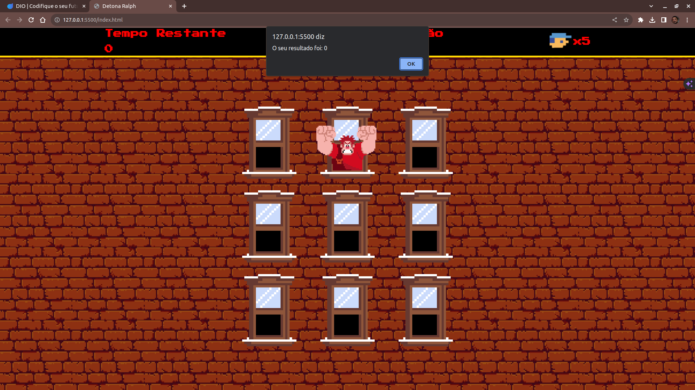
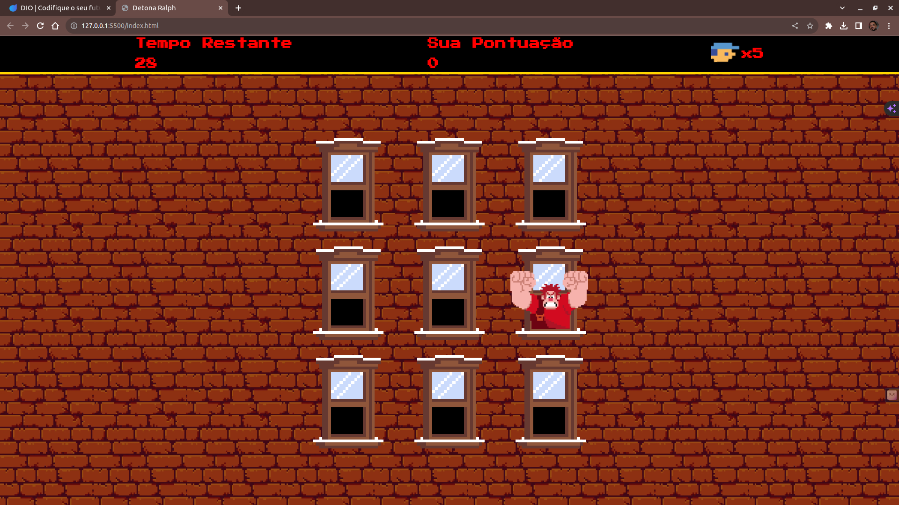

## Detona Ralph
> Desafio DIO - Criando um Jogo do Detona Ralph com JavaScript

## 📋 Índice

- [📖 Sobre](#-Sobre)
- [🚀 Tecnologias utilizadas](#-Tecnologias-utilizadas)
- [🖥 Preview](#-Preview)
- [📌 Créditos](#-Créditos)

## 📖 Sobre
Projeto desenvolvido durante o Bootcamp [Potência Tech iFood - Desenvolvimento de Jogos](https://web.dio.me/track/potencia-tech-ifood-desenvolvimento-de-jogos). O jogo é baseado no filme Detona Ralph, onde o objetivo é acertar o Ralph na janela que ele aparecer.

## 🚀 Tecnologias utilizadas

## 🖥 Preview:

  
  

## 📌 Créditos:
  - Assets retirados do repositório: [digitalinnovationone/jsgame-detona-ralph](https://github.com/digitalinnovationone/jsgame-detona-ralph)

  - Outros assets: 
    - [miss.m4a](./src/sounds/miss.m4a) = [Swing and miss - Sound Effect](https://www.youtube.com/watch?v=mdOYC8p7PkA)
    - [janela-sem-ralph.png](./src/imgs/janela-sem-ralph.png)
